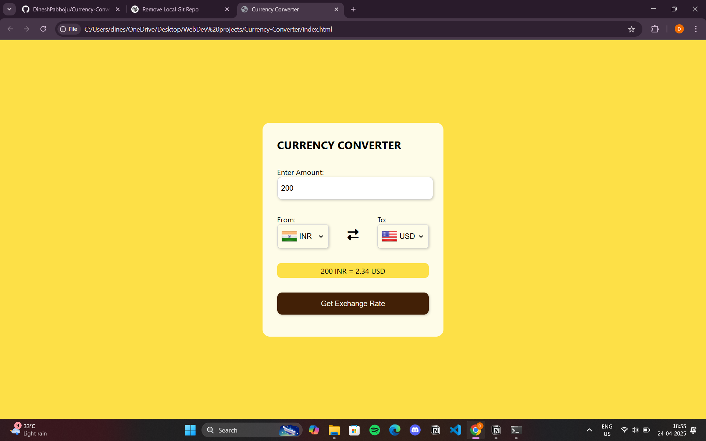

# 💱 Currency Converter

A simple and efficient currency converter web application built using HTML, CSS, and JavaScript. This project allows users to convert values between different currencies using real-time exchange rates fetched via an API.

---

## 🚀 Features

- 🔄 Real-time currency conversion
- 🌍 Supports multiple currencies
- 🧠 Easy-to-use user interface
- 🧩 Clean, responsive design
- 🔗 Uses Fetch API to get live exchange rates

---

## 🛠️ Tech Stack

- **HTML5**
- **CSS3**
- **JavaScript (ES6+)**
- **Fetch API**
- **Exchange Rate API** *(or similar API service for currency data)*

---

## 📸 Demo

  


---

## 📂 Project Structure

Currency-Converter/
├── index.html         # Main HTML file for the web app layout
├── style.css          # CSS file for styling the application
├── app.js          # JavaScript file for logic and API interaction
├── README.md          # Documentation for the project


---

## 🧑‍💻 Getting Started

1. **Clone the repository:**
   ```bash
   git clone https://github.com/DineshPabboju/Currency-Converter.git
2. Navigate into the project directory:
   cd Currency-Converter
3. Open index.html in your browser to run the app locally.


🙌 Contributing
Contributions are welcome! Please open issues or submit a pull request for any features, bugs, or suggestions.
